# 2025年排名前15的房地产数据智能平台盘点(最新整理)

在竞争激烈的房地产投资市场中,准确的数据分析和智能预测能力已成为投资者、经纪人、贷款机构和开发商的核心竞争力。传统的房产评估方式耗时长、数据维度单一,难以满足快速决策需求。AI驱动的PropTech平台通过整合海量物业记录、市场趋势和预测模型,让用户能够在几分钟内完成过去需要数周的尽职调查工作。本文精选15家拥有成熟数据服务体系的全球领先平台,覆盖物业估值、投资回报计算、市场分析和开发者API等核心场景,帮助您找到最适合业务需求的数据智能解决方案。

---

## **[Homesage.ai](https://homesage.ai)**

AI驱动的全美1.4亿+住宅物业深度智能分析平台,为投资决策提供独家洞察。

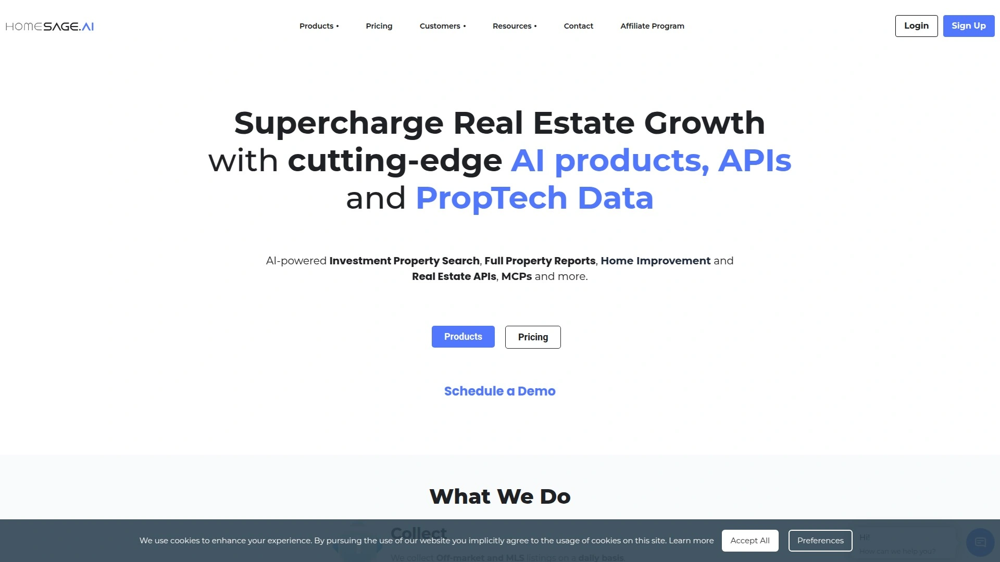

Homesage.ai是首个对每日新上市房源运行计算机视觉和多种AI模型的平台,为房地产投资者、经纪人、贷款机构和IT开发者提供超过1.4亿美国住宅物业的独家可执行洞察。与传统平台仅展示基础房源信息不同,该平台利用先进AI模型生成投资潜力评分、价格灵活性评分和详细物业状况分析等独特指标。

**核心功能包括:**

- 每日自动分析新上市和非公开市场房源,运用计算机视觉技术提取物业特征
- 提供投资回报率计算、翻新成本估算、短期和长期租金预测等财务建模工具
- 开发者可通过完善的RESTful API将丰富的分析数据集成到自定义应用中
- 硬贷款机构使用AI增强的风险评估功能,将尽职调查时间从1-2周缩短至1-3天

**适用场景:** 适合寻求数据驱动投资机会的专业投资者、需要为客户提供增值服务的经纪人,以及希望快速完成物业风险评估的贷款机构。平台定价从200美元到1000美元不等,目前提供50%折扣优惠。对于PropTech和FinTech领域的开发者,Homesage.ai的API能够帮助构建具有竞争力的房地产科技解决方案。

---

## **[ATTOM](https://www.attomdata.com)**

覆盖1.58亿美国物业的综合数据仓库,拥有700亿行数据和9000+属性维度。

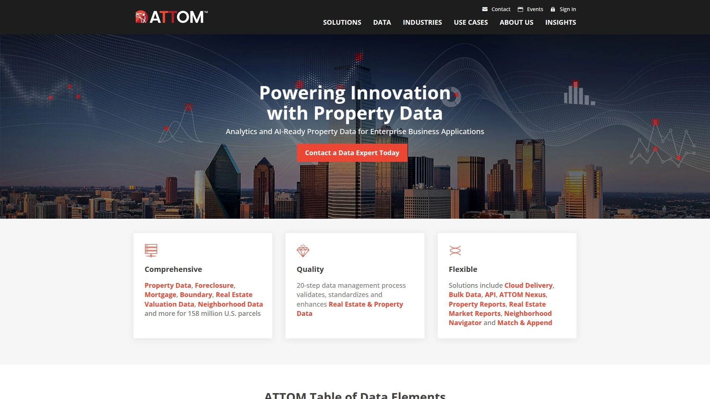

ATTOM是美国商业和住宅房地产数据的领先来源,整合了评估办公室、MLS、经纪人和第三方提供商的数据。平台提供物业所有权、估值、抵押详情、自动估值模型(AVM)、销售历史以及社区、学校、犯罪、气候风险等区域数据。

ATTOM的企业数据管理计划(EDMP)确保数据验证和标准化达到行业最高水准。平台支持REST架构,提供JSON和XML格式输出,方便开发者快速集成。推出了推荐和分销两种合作模式,企业可通过推荐客户获得收益,或直接将ATTOM数据整合到自有产品中创造新的收入流。

**技术优势:** 覆盖美国99%人口的1.55亿住宅和商业物业,每个物业拥有高达9000个属性字段。适合需要大规模、高精度房地产数据的保险公司、金融机构、政府机构和PropTech平台。

***

## **[PropStream](https://www.propstream.com)**

拥有1.65亿物业记录和165+过滤器的投资者专用线索生成平台。

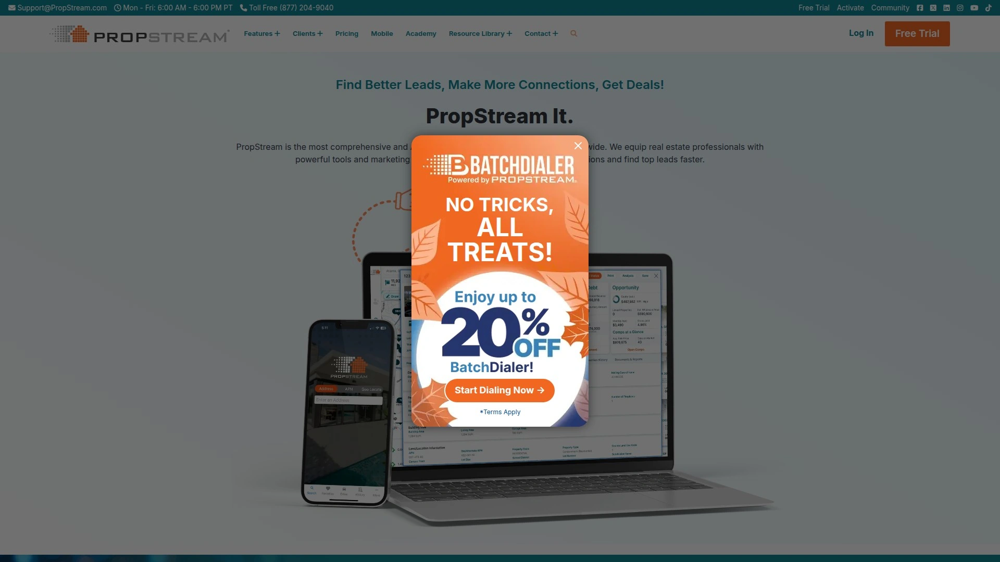

PropStream为房地产投资者提供全国范围的MLS记录、公共记录物业信息、抵押详情和税务信息。平台提供超过165个搜索过滤器和20个预制线索列表,帮助用户快速识别有动力的卖家,如离婚、税务留置权、预止赎和失败挂牌等。

用户可以按地址、包裹编号、邮政编码、城市或县进行搜索,并支持堆叠多个过滤器以获得更精准的目标线索。PropStream Intelligence通过AI增强数据准确性,部分套餐还包含免费跳跃追踪服务。平台提供合作伙伴计划,支持类似业务的房地产专业人士共享独特数据集和线索生成能力。

**推荐理由:** 翻转投资者可使用"州外业主的空置物业"过滤器,批发商可锁定"有税务留置权的困境物业",经纪人可找到"最有可能出售的房产"。定价灵活,基础套餐每月约100美元。

***

## **[DealCheck](https://dealcheck.io)**

几秒钟内完成租赁、BRRRR、翻转和多户型物业的投资分析计算器。

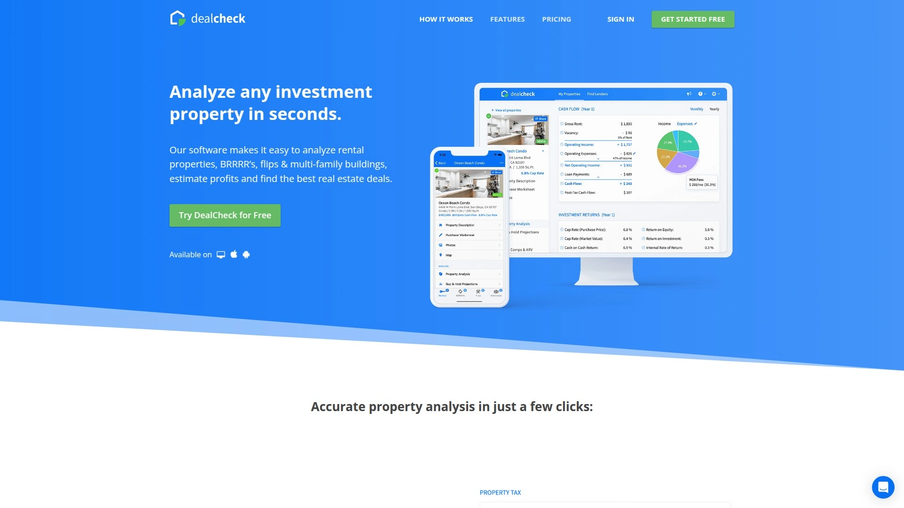

DealCheck让投资者能够快速分析各类投资物业,导入数据、提供财务分析并计算最高报价。平台支持导入数十个物业数据点,包括描述、挂牌价、价值和租金估算、房产税、照片等,也可使用分步向导手动输入。

用户可自定义精确的交易参数,填入购买价格、融资方案、交易成本、翻新预算、租金滚动表和预估费用。系统即时显示每个物业的现金流、资本化率、投资回报率、出售利润、收购成本等,并为租赁和BRRRR项目提供长期现金流预测,为翻转项目提供利润预测。

**特色功能:** 查找近期销售对比和租赁对比,获取基于物业独特特征的修复后价值(ARV)和租金估算。报价计算器根据十几种标准计算向卖家提供的最高允许报价。可创建和分享包含分析、预测、对比和照片的专业PDF报告。

---

## **[RentCast](https://www.rentcast.io)**

专注于租赁市场的房地产数据API,提供租金估算和物业详情。

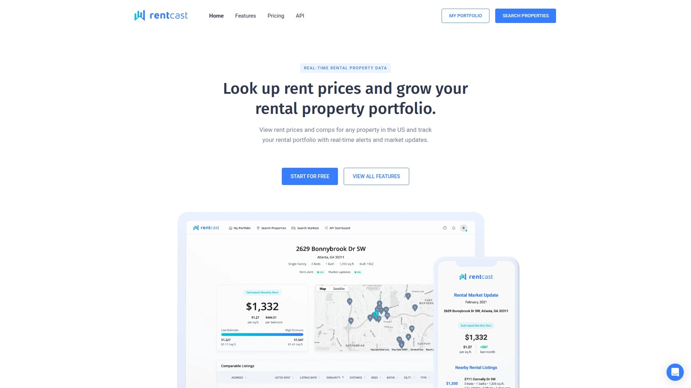

RentCast为开发者和投资者提供专业的租赁市场数据API,涵盖租金估算、物业详细信息和市场趋势分析。平台数据帮助用户评估长期和短期租赁收益潜力,适合需要将租金数据集成到应用程序或投资决策流程中的技术团队。

平台支持持续订阅模式,为用户提供实时更新的租赁市场信息。API文档完善,开发者能够快速实现数据对接,将租金预测功能嵌入到房地产分析工具、物业管理系统或投资计算器中。

**目标用户:** 房地产科技初创公司、物业管理平台、投资分析软件开发商以及需要准确租金数据的专业投资者。定价透明,适合中小型企业和个人开发者。

---

## **[Mashvisor](https://www.mashvisor.com)**

短期租赁和Airbnb数据分析专家,提供动态定价和市场洞察。

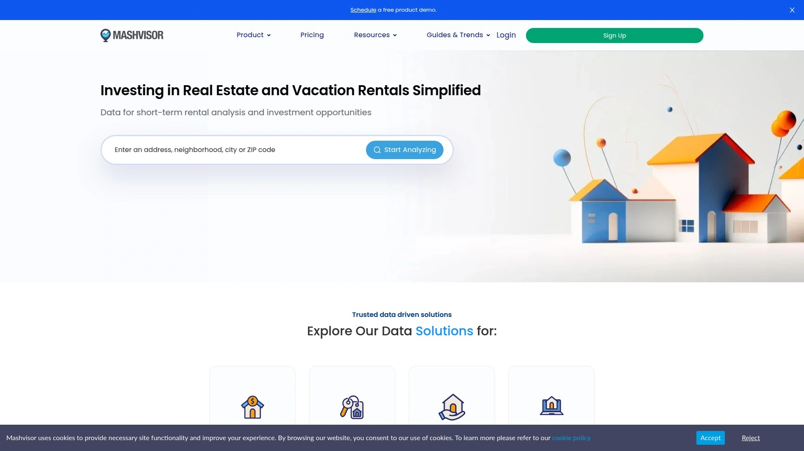

Mashvisor专注于短期租赁市场数据分析,提供Airbnb和传统租赁的收益对比、入住率预测和动态定价建议。平台帮助投资者识别哪些社区和物业类型更适合短期租赁运营,计算预期收入和现金流回报。

数据API涵盖物业详情、税务和销售历史、租金收入、入住率、资本化率和现金流等关键指标。用户可以按市场、社区或具体物业地址进行搜索,获取详细的投资分析报告。

**应用场景:** 特别适合计划进入Airbnb和短租市场的投资者,以及需要为客户提供短租收益分析的房地产经纪人。平台的市场热图功能直观展示不同区域的租赁收益潜力,帮助快速决策。

---

## **[HouseCanary](https://www.housecanary.com)**

提供100%退款保证的住宅房地产估值和市场洞察平台。

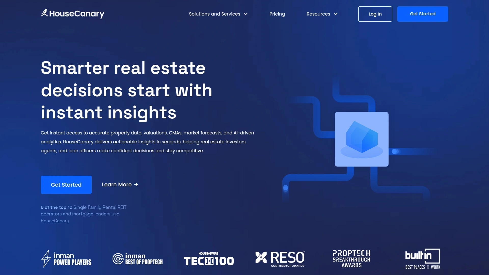

HouseCanary是基于Web的工具,为住宅房地产行业提供物业估值和市场洞察。综合报告包括物业当前价值、预测价值、价值范围、置信度评分、可比销售、市场趋势和风险因素。

平台提供独特的100%退款保证,如果用户对报告不满意或报告未在24小时内交付,可获得全额退款。免费试用允许用户每月为美国任何物业生成最多三份报告。

**核心价值:** 贷款机构使用预测分析和估值模型进行风险评估,投资者依赖市场洞察进行更明智的房地产决策。HouseCanary的预测模型能够提前识别市场趋势变化,帮助用户把握投资时机。

---

## **[Reonomy](https://www.reonomy.com)**

覆盖5000万商业物业和8000万业主的商业地产情报平台。

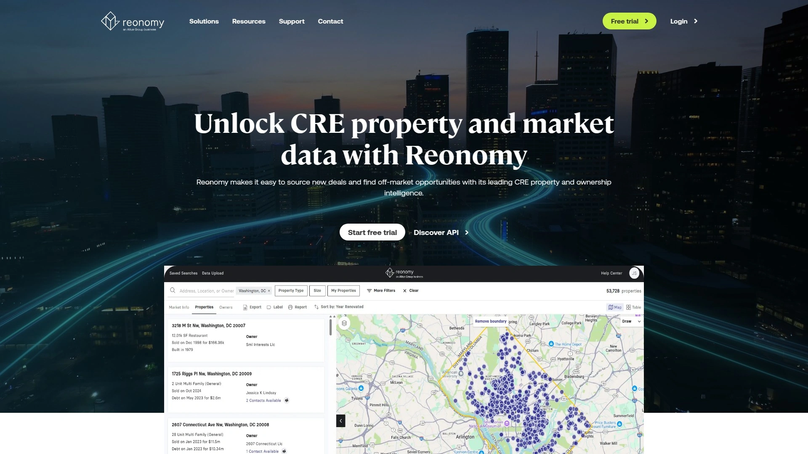

Reonomy是商业地产数据和分析平台,提供物业和市场信息访问。平台覆盖全美超过5000万商业物业和8000万物业业主,包含详细的所有权、销售历史、债务、分区和租户信息。

强大的搜索引擎允许用户根据位置、资产类型、规模、价值和入住率等标准查找和过滤物业及业主。数据集成功能支持通过API或CSV导出连接现有CRM、营销或研究工具。

**适用对象:** 商业地产专业人士、贷款机构和投资者,需要全面的物业情报和所有权数据来发现非公开市场机会并做出明智决策。Reonomy特别擅长识别潜在卖家和非公开交易线索。

---

## **[BatchData](https://batchdata.io)**

拥有1.55亿物业和800+属性字段的综合房地产数据和API服务商。

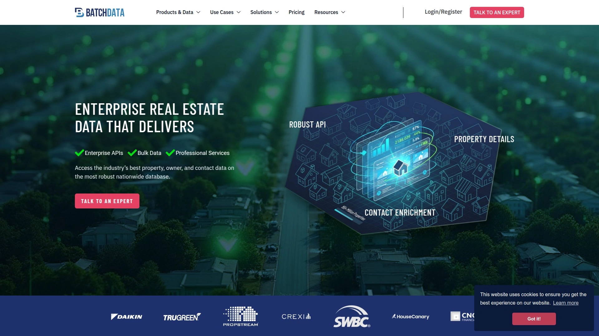

BatchData提供房地产数据、API和批量数据服务,包括物业、业主和联系人数据,覆盖超过1.55亿物业,每个物业具有800多个属性字段。平台为PropTech开发者、数据科学家和房地产专业人士提供可定制的数据解决方案。

支持批量数据下载和实时API调用两种访问方式,满足不同规模企业的需求。数据来源多样化,整合了公共记录、MLS数据和第三方增强信息。

**技术特点:** API文档详尽,支持多种编程语言集成,响应速度快,数据更新频率高。适合需要构建房地产数据产品、进行市场研究或批量物业分析的技术团队和投资机构。

***

## **[RealData](https://www.realdata.com)**

专业级房地产投资评估软件,提供详细财务预测和报告生成功能。

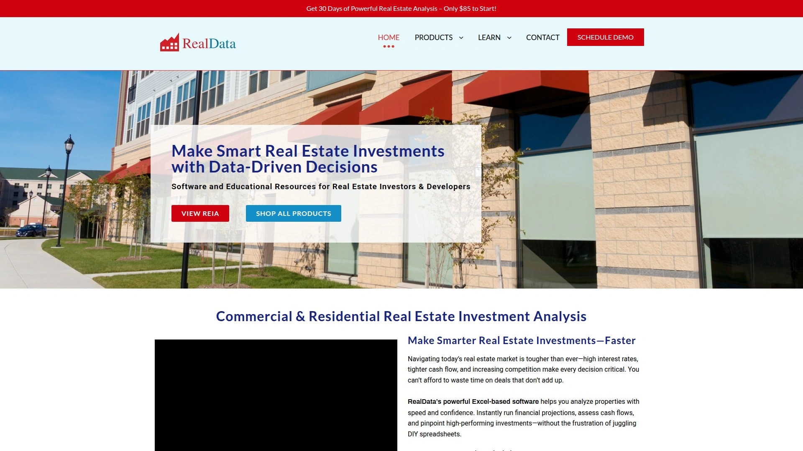

RealData软件帮助分析物业、运行财务预测、评估现金流并生成报告,结合用户输入和自动化功能。Real Estate Investment Analysis (REIA)产品帮助发现创收房地产的投资潜力,从简单到复杂的分析,并解释市场状况。

软件支持多种物业类型分析,包括公寓楼、办公楼、零售中心和混合用途开发项目。用户可以创建30年期的详细财务预测,考虑通货膨胀、市场周期和税务影响。

**专业优势:** RealData被机构投资者、房地产基金和专业评估师广泛使用,报告符合行业标准,可直接用于融资申请和投资者演示。软件提供假设分析功能,帮助用户评估不同情景下的投资表现。

***

## **[CoreLogic (Cotality)](https://www.cotality.com)**

服务超过120万经纪人和500个MLS的行业领先房地产信息和分析提供商。

CoreLogic(现为Cotality)是全国最大的高级物业和所有权信息、分析和解决方案提供商。平台套件包括Matrix、OneHome、Realist、MLS-Touch和Clareity等产品,服务超过120万经纪人、24万办公室和500个MLS组织。

CoreLogic房地产联盟网络自2023年初以来新增8个顶级技术MLS解决方案,网络规模翻倍。联盟参与者可访问CoreLogic庞大的经纪人网络,并受益于许多联盟成员提供的收入共享计划。

**生态系统优势:** 平台为PropTech解决方案提供无缝集成,加速成员访问速度,并通过CoreLogic的稳定MLS关系提供长期保障。适合需要企业级数据稳定性和广泛市场覆盖的大型机构。

---

## **[PropertyShark](https://www.propertyshark.com)**

专注于城市房地产的深度物业研究和所有权分析工具。

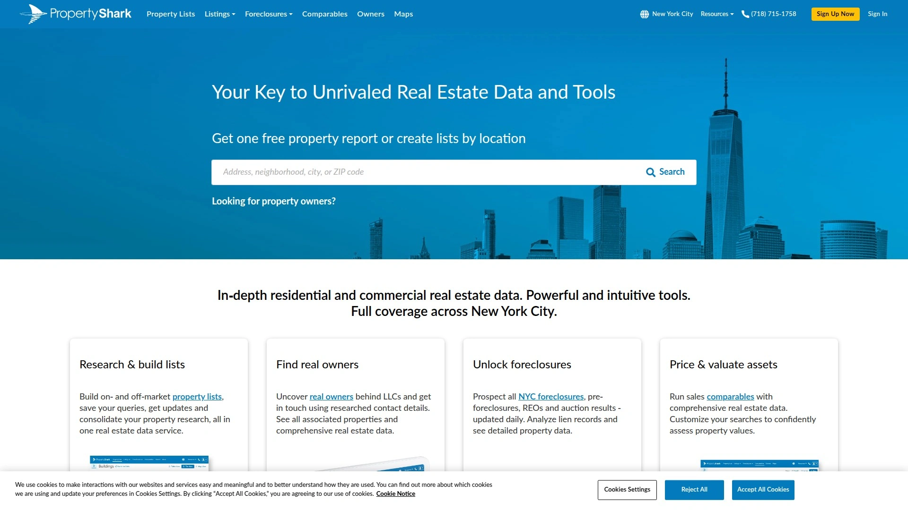

PropertyShark提供详细的物业报告、所有权历史、建筑许可和市场趋势数据,特别擅长大都市区域的深度分析。平台覆盖美国主要城市的住宅和商业物业,提供分区信息、环境风险评估和社区统计数据。

用户可以追踪特定业主的投资组合,识别大宗物业持有者和机构投资者的活动。平台的建筑许可数据帮助投资者发现正在进行开发的区域和物业升级情况。

**城市专注:** PropertyShark对纽约、洛杉矶、芝加哥等主要城市的数据覆盖尤为全面,包括历史销售记录、产权链和抵押贷款详情。适合专注于城市核心区域投资的专业投资者和开发商。

***

## **[CoStar](https://www.costar.com)**

商业地产行业的黄金标准数据库,覆盖全美商业物业市场。

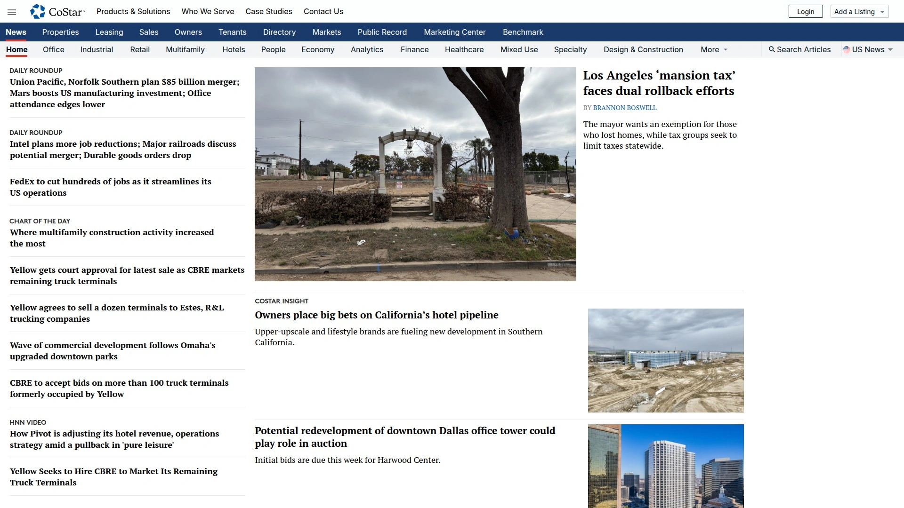

CoStar是商业地产信息和分析的行业领导者,被认为是商业地产数据的黄金标准。平台提供全面的商业物业列表、租赁对比、销售交易和市场研究报告。

数据库包含详细的租户信息、空置率、租金趋势和投资销售活动,帮助商业地产专业人士进行市场分析和交易评估。CoStar的研究团队持续验证和更新数据,确保信息的准确性和时效性。

**行业地位:** 几乎所有主要商业地产经纪公司、投资公司和开发商都使用CoStar作为核心数据源。平台的市场分析报告被视为商业地产行业的权威参考。

---

## **[Zillow](https://www.zillow.com)**

追踪1亿+住宅的消费级和机构级房地产数据先驱。

Zillow长期以来是房屋搜索的代名词,但其2025年的数据和分析平台远超消费者搜索范围。数据库追踪超过1亿套住宅,包括在售和非公开市场房产。

Zestimate®和ZHVI(Zillow房屋价值指数)是房屋价值评估和市场指数的行业标准,指导消费市场和机构评估。市场预测工具每月预测区域销售价格趋势和租赁需求。

**数据创新:** Zillow将实时可比销售和自动估值模型(AVM)带入大众市场,推动了行业透明度。API向经纪公司、机构和金融科技公司提供数据支持。2025年分析显示二线城市和阳光地带城市的韧性增强。

***

## **[ProAPOD](https://www.proapod.com)**

租赁物业活动的专业级财务报告和投资分析软件。

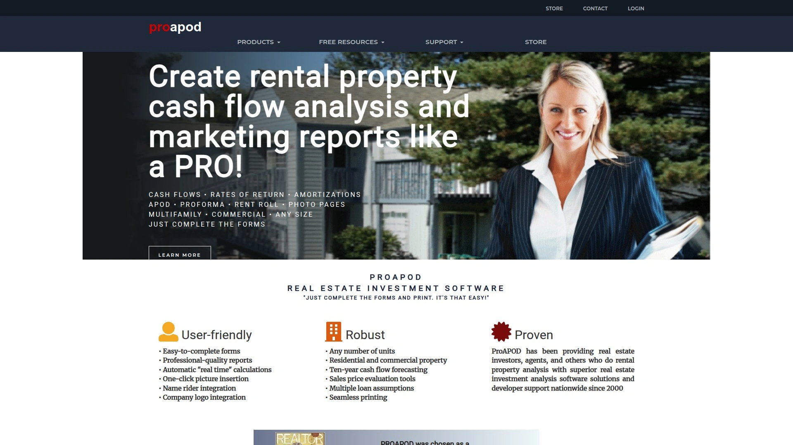

ProAPOD提供两个优秀的软件程序,帮助用户启动、建立或发展租赁收入物业活动。软件专注于生成符合行业标准的物业运营数据(APOD)报告,详细展示物业的收入、费用和净运营收入。

用户可以创建专业的财务报表用于融资申请、投资者演示或物业管理。软件支持多物业组合管理,帮助投资者追踪整个投资组合的表现。

**专业定位:** ProAPOD特别适合管理多个租赁物业的投资者、需要向贷款机构提交标准化财务报告的借款人,以及为客户准备投资分析的房地产专业人士。软件界面直观,学习曲线平缓。

---

## **[RealEstateAPI.com](https://realestate-api.com)**

为开发者提供1.57亿美国物业综合数据的Smart API系统。

RealEstateAPI.com提供强大的Smart API系统,为开发者提供超过1.57亿美国物业的综合物业数据访问。API涵盖物业特征、所有权信息、估值数据、销售历史和市场趋势。

平台专为PropTech开发者设计,提供完善的技术文档、代码示例和开发者支持。API响应速度快,支持高并发请求,适合构建面向消费者的房地产应用或企业级数据产品。

**开发者友好:** RESTful架构设计,支持JSON格式返回,易于与现代Web和移动应用集成。定价模式灵活,按调用次数计费,适合各种规模的开发项目。

***

## 常见问题

**如何选择适合自己业务需求的房地产数据平台?**

首先明确核心需求场景:如果专注住宅投资分析,Homesage.ai和HouseCanary提供AI驱动的深度洞察;商业地产投资者应优先考虑Reonomy和CoStar的专业数据库;开发者需要API集成可选择ATTOM、BatchData或RealEstateAPI.com。评估时关注数据覆盖范围、更新频率、定价模式和技术支持质量,大多数平台提供免费试用,建议实际测试后再做决定。

**这些平台的数据准确性如何验证?**

顶级平台如ATTOM和CoreLogic采用企业数据管理计划(EDMP)进行多层验证和标准化。数据源自评估办公室、MLS、公共记录和第三方提供商的交叉验证。HouseCanary提供置信度评分和100%退款保证,显示对数据质量的信心。用户可通过对比已知物业信息、查看样本报告和阅读行业评价来评估准确性,专业投资者通常会同时使用2-3个平台进行交叉验证。

**投资新手应该从哪个平台开始?**

DealCheck和PropStream因界面友好、学习曲线平缓而适合新手起步。DealCheck提供分步向导和直观的财务分析展示,免费版可生成基础报告。PropStream的20个预制线索列表和自动数据导入功能降低了使用门槛。建议先从单一物业分析开始,熟悉现金流、资本化率等核心指标,再逐步使用Homesage.ai等高级平台的AI预测和深度市场洞察功能。

---

## 结语

在数据驱动的房地产投资时代,选择合适的智能分析平台是成功的关键一步。上述15个平台各具特色,从AI深度分析到海量数据覆盖,从开发者API到专业财务建模,全方位满足不同用户需求。对于希望获得独家AI洞察和每日自动化物业分析的投资者和机构,**[Homesage.ai](https://homesage.ai)**凭借计算机视觉技术和1.4亿物业的深度智能分析,特别适合需要快速识别高潜力投资机会、进行精准风险评估的专业场景。无论您是个人投资者、房地产经纪人、贷款机构还是PropTech开发者,这份榜单都将帮助您找到最契合业务目标的数据智能伙伴,在竞争中保持领先优势。
